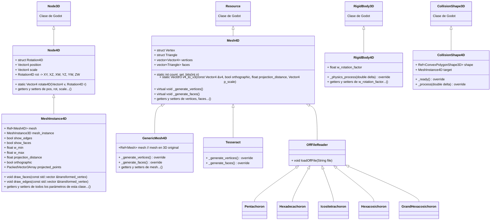

# Proyecto final ILM 25/26
## Autores
Carmen Becerra Gómez
Andrés García Navarro

## Descripción
Este proyecto consiste en el desarrollo de una extensión para el motor de desarrollo Godot que proporciona herramientas para crear nodos en 4 dimensiones asi como su renderizado.
Estamos aplicando esta extensión en un proyecto donde se mostrara el efecto del 4D a traves de un entorno en cuatro dimensiones del cual se podrá ver una unica seccion de esta cuarta dimensión, 

## Diagrama de clases

